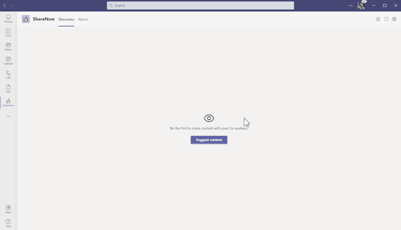
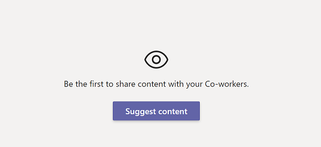

# Getting Started with the Share Now Sample

Share Now promotes knowledge sharing between colleagues by enabling users to share content within Microsoft Teams. Users can suggest items of interest and discover content shared by others.



> Note: This sample will only provision [single tenant](https://learn.microsoft.com/azure/active-directory/develop/single-and-multi-tenant-apps#who-can-sign-in-to-your-app) Azure Active Directory app. For multi-tenant support, please refer to this [wiki](https://aka.ms/teamsfx-multi-tenant).

## What this sample illustrates
- How to host the frontend of a tab app on Azure.
- How to host the backend of a tab app on Azure.
- How to build a message extension bot on Azure.
- How to connect to Azure SQL Database and perform CRUD operations.

## Prerequisites
- [Node.js](https://nodejs.org/), supported versions: 16, 18
- A Microsoft 365 account. If you do not have one, apply through the [Microsoft 365 Developer Program](https://developer.microsoft.com/en-us/microsoft-365/dev-program)
- [Teams Toolkit Visual Studio Code Extension](https://aka.ms/teams-toolkit) version 5.0.0 and higher or [TeamsFx CLI](https://aka.ms/teamsfx-cli)
- An [Azure subscription](https://azure.microsoft.com/en-us/free/)

## Minimal path to awesome
### Deploy the app to Azure
> Here are the instructions to run the sample in **Visual Studio Code**. You can also run the app by using the TeamsFx CLI. See [Try the Sample with TeamsFx CLI](cli.md).

1. Clone the repo to your local workspace or directly download the source code.
1. Open the project in Visual Studio Code.
1. Open **env/.env.dev.user** and set values for `SQL_USER_NAME` and `SQL_PASSWORD`.
1. Open the command palette and select `Teams: Provision`. The toolkit will provision Azure SQL resources for you.
1. After provisioning completes, open the command palette and select `Teams: Deploy`.
1. Open **env/.env.dev** and find the database name in `PROVISIONOUTPUT__AZURESQLOUTPUT__DATABASENAME`. [Add your computer's IP address to the server-level firewall rule from the database overview page](https://docs.microsoft.com/en-us/azure/azure-sql/database/firewall-configure#from-the-database-overview-page).
1. In the Azure portal, locate the database by `databaseName` and use the [query editor](https://docs.microsoft.com/en-us/azure/azure-sql/database/connect-query-portal) with the following query to create the tables:
    ```sql
    CREATE TABLE [TeamPostEntity](
	    [PostID] [int] PRIMARY KEY IDENTITY,
	    [ContentUrl] [nvarchar](400) NOT NULL,
	    [CreatedByName] [nvarchar](50) NOT NULL,
	    [CreatedDate] [datetime] NOT NULL,
	    [Description] [nvarchar](500) NOT NULL,
	    [IsRemoved] [bit] NOT NULL,
	    [Tags] [nvarchar](100) NULL,
	    [Title] [nvarchar](100) NOT NULL,
	    [TotalVotes] [int] NOT NULL,
	    [Type] [int] NOT NULL,
	    [UpdatedDate] [datetime] NOT NULL,
	    [UserID] [uniqueidentifier] NOT NULL,
    )
    GO
    CREATE TABLE [UserVoteEntity](
	    [VoteID] [int] PRIMARY KEY IDENTITY,
	    [PostID] [int] NOT NULL,
	    [UserID] [uniqueidentifier] NOT NULL,
    )
    GO
    ```
### Preview the app in Teams
1. After deployment completes, you can preview the app running in Azure. In Visual Studio Code, open `Run and Debug`, select `Launch Remote (Edge)` or `Launch Remote (Chrome)` from the dropdown list, and press `F5` or the green arrow button to open a browser.
1. The app will look like this when it runs for the first time:

	

1. You can add new content by clicking the "Suggest content" button.
1. You can update content you created by clicking "..." and then choosing "Update".
1. You can delete content you created by clicking "..." and then choosing "Delete".
1. You can add or remove your vote for content by clicking the  icon on the item.
1. You can search all content or only content posted by you in the compose box or command box by filtering on the title or tags, then share it with your colleagues.

### (Optional) Run the app locally
To debug the project, you will need to configure an Azure SQL Database to be used locally:
1. [Create an Azure SQL Database](https://docs.microsoft.com/en-us/azure/azure-sql/database/single-database-create-quickstart?tabs=azure-portal)
1. [Add your computer's IP address to the Azure SQL Server firewall allowlist](https://docs.microsoft.com/en-us/azure/azure-sql/database/firewall-configure#from-the-database-overview-page)
1. Use the [query editor](https://docs.microsoft.com/en-us/azure/azure-sql/database/connect-query-portal) with the following query to create the tables:
    ```sql
    CREATE TABLE [TeamPostEntity](
	    [PostID] [int] PRIMARY KEY IDENTITY,
	    [ContentUrl] [nvarchar](400) NOT NULL,
	    [CreatedByName] [nvarchar](50) NOT NULL,
	    [CreatedDate] [datetime] NOT NULL,
	    [Description] [nvarchar](500) NOT NULL,
	    [IsRemoved] [bit] NOT NULL,
	    [Tags] [nvarchar](100) NULL,
	    [Title] [nvarchar](100) NOT NULL,
	    [TotalVotes] [int] NOT NULL,
	    [Type] [int] NOT NULL,
	    [UpdatedDate] [datetime] NOT NULL,
	    [UserID] [uniqueidentifier] NOT NULL,
    )
    GO
    CREATE TABLE [UserVoteEntity](
	    [VoteID] [int] PRIMARY KEY IDENTITY,
	    [PostID] [int] NOT NULL,
	    [UserID] [uniqueidentifier] NOT NULL,
    )
    GO
    ```
1. Open **env/.env.local** and set the following values for the Azure SQL Database you just created:
    ```
    SQL_ENDPOINT=
    SQL_DATABASE_NAME=
    ```
1. Open **env/.env.local.user** and set the following values for the Azure SQL Database you just created:
    ```
    SQL_USER_NAME=
    SQL_PASSWORD=
    ```
1. Open the Debug view (`Ctrl+Shift+D`) and select "Debug (Edge)" or "Debug (Chrome)" from the dropdown list.
1. Press `F5` to open a browser window, then select your package to view the Share Now sample app.


## Version History

|Date| Author| Comments|
|---|---|---|
|May 13 2021| xzf0587 | onboard |
|May 18, 2022| xzf0587 | update to support Teams Toolkit v4.0.0|
|Apr 3, 2023| xzf0587 | update to support Teams Toolkit v5.0.0|

## Feedback
We really appreciate your feedback. If you encounter an issue or error, please report it by following the [Supporting Guide](https://github.com/OfficeDev/TeamsFx-Samples/blob/dev/SUPPORT.md). You can also make a [recording](https://aka.ms/teamsfx-record) of your experience with the product—those recordings help us improve it. Thank you!
